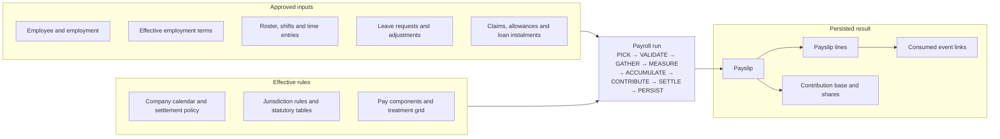

# Payroll architecture

## Purpose

Payroll is a deterministic settlement engine over approved, effective-dated records. It does not
copy a source payslip. It reads the contract, events and governing rules for one company and period,
calculates a draft, persists a source-linked result, and freezes that result when paid.



## The pillars

| Pillar     | Records                                                                  | Responsibility                                                                        |
| ---------- | ------------------------------------------------------------------------ | ------------------------------------------------------------------------------------- |
| Identity   | `employees`, `employments`                                               | Person, company, hire/exit and bank/statutory identity                                |
| Contract   | `employment_terms`, `employment_statutory_facts`                         | Salary, hours, working pattern, OT coverage and scheme standing over effective ranges |
| Calendar   | `shift_definitions`, `roster_entries`, `company_holidays`                | Scheduled work, rest/off days, holidays and substitute holidays                       |
| Events     | `time_entries`, `leave_requests`, `leave_ledger`, `component_entries`    | What happened and what money or leave movement was authorised                         |
| Agreements | `repayment_agreements` and generated instalment `component_entries`      | Exact dated recovery schedule and consumption of each instalment                      |
| Catalogue  | `component_types`, `pay_components`                                      | What a line means and how it is measured                                              |
| Law        | `jurisdictions`, contribution/rate/treatment tables, OT rules and limits | Effective statutory calculation and minimum treatment                                 |
| Settlement | `payroll_runs`, `payslips`, lines, contributions and sources             | Calculated result, audit trail and paid-period immutability                           |

## Input planes

Every amount enters the engine through one of four planes:

1. `SCHEDULE`: contractual salary measured from effective terms and employment dates.
2. `ENTRY`: an approved money event such as an allowance, reimbursement, correction or loan
   instalment.
3. `FORMULA`: a derived value over terms, approved leave movements, earlier measured components and
   period facts.
4. `OVERTIME` / `OVERTIME_EXCESS`: dated time entries priced by schedule, day type and statutory
   rules.

The planes meet at `payslip_lines`. Contribution logic consumes typed lines rather than customer
component names; therefore a customer cannot decide that “overtime is EPF wages” by renaming a
component.

## Effective dating

Terms and statutory configuration are not overwritten in place. A change closes the earlier
effective range and creates a successor row. Payroll selects configuration once for the run and
stores a `configuration_hash`; the hash detects a rebuild against different rules.

Effective dating solves two different questions:

- which facts governed a historical day; and
- which facts govern a future recalculation.

It does not, by itself, freeze a paid result. Paid-run locking does that; see
[Adjustments, ledgers and locking](adjustments-ledgers-and-locking.md).

## Approval boundary

Approval belongs to Pod. A pending record carries `norbital_approval_id` and is locked; payroll reads
only rows whose approval id is null. An open clock is also rejected because elapsed time is not yet
known. Payroll lifecycle (`DRAFT` or `PAID`) is separate from approval state.

## Result identities

The final records obey these identities:

```text
gross = earnings − absence lines
net = gross − employee statutory shares − deduction lines + non-wage payments
employer cost = employer statutory shares + employer-cost lines
```

Each contribution persists its wage base as well as employee and employer amounts. This is essential:
an amount can match by coincidence even when the base is wrong.

## What is deliberately not stored

- No mutable YTD accumulator: YTD is summed from earlier `PAID` results.
- No accrued-leave cache: contractual accrual is derived at the requested date.
- No payment ledger duplicated from payslips: payment files are projections from paid results.
- No seeded overtime or incentive-overtime result: both are calculated from dated inputs.
- No “consumed” boolean: consumption is the existence of a persisted relationship.

The detailed mechanisms are in the linked architecture chapters from the documentation index.
