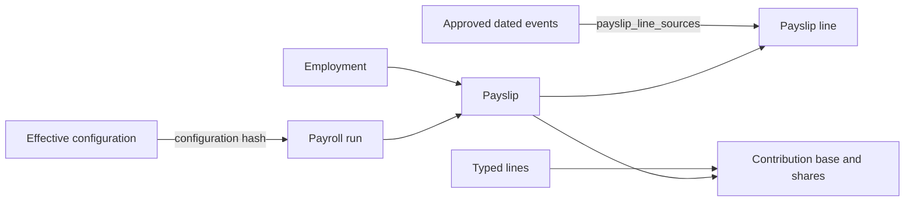

# Provenance and audit

## What a calculated result records

The audit layers serve different questions:

| Record                              | Question answered                                                             |
| ----------------------------------- | ----------------------------------------------------------------------------- |
| `payroll_runs.configuration_hash`   | Did this run select the same effective configuration snapshot?                |
| `payslips.employment_id`            | Which employment was settled?                                                 |
| `payslip_lines`                     | Which typed earning, absence, deduction or employer-cost line was measured?   |
| `payslip_line_sources`              | Which component entry, time entry or leave request was consumed by that line? |
| `payslip_contributions.base_amount` | Which statutory wage base produced the employee/employer shares?              |
| Paid-run state and audit events     | When did a mutable draft become the frozen payroll result?                    |
| Generated workbook hash             | Which exact exported file was compared during reconciliation?                 |

`configuration_hash` is a change detector. It is not a row-by-row foreign-key graph and cannot by
itself reconstruct deleted configuration.

## Consumption

There is no `consumed = true` flag. Consumption means that a persisted payslip line has a source
relationship to an input record. This avoids a mutable boolean that can drift away from the result.

Current direct source kinds are:

- `COMPONENT_ENTRY` for claims, allowances, adjustments and recovery instalments;
- `TIME_ENTRY` for overtime and other attendance-priced results; and
- `LEAVE_REQUEST` for leave-driven lines.

A relationship is created only after measurement succeeds. Deferred entries remain unlinked until
their assigned settlement period is paid.

## Current provenance gaps

The implementation is not yet a complete dependency graph:

1. scheduled salary lines do not directly link the effective `employment_terms` rows they used;
2. formula lines do not enumerate every term, statutory fact, roster, shift, holiday or rate-table
   row consulted;
3. the configuration hash does not preserve those rows as immutable historical objects; and
4. general source-link existence is not yet a universal mutation lock.

The fresh linkage audit checks the following:

1. every in-period component entry consumed by a paid run has a `payslip_line_sources` relationship;
2. deferred entries assigned to a later period remain unlinked until that period is paid;
3. derived lines such as late-joiner basic arrears are allowed to lack a direct input link, but must
   not be mistaken for seeded inputs; and
4. the audit report lists any derived line that lacks a typed derivation relationship so the provenance
   design gap stays visible.

When derived joiner-arrears lines appear without a direct source relationship, a fake input link would
be wrong. The correct future design is a typed `DERIVATION` relationship to the terms and prior
period used.

## Required audit checks

Before a reconciliation can be called current, verify all of the following:

1. every run is calculated from approved inputs and then marked paid in chronological order;
2. no in-window component entry lacks a source link unless the line is explicitly derived;
3. deferred entries are not linked early;
4. contribution bases reconcile with their typed lines;
5. source and generated employee-month keys are unique before YTD summation;
6. workbook hashes and run timestamp are recorded; and
7. every variance claim cites both the source XLSX cell and the generated XLSX cell.
