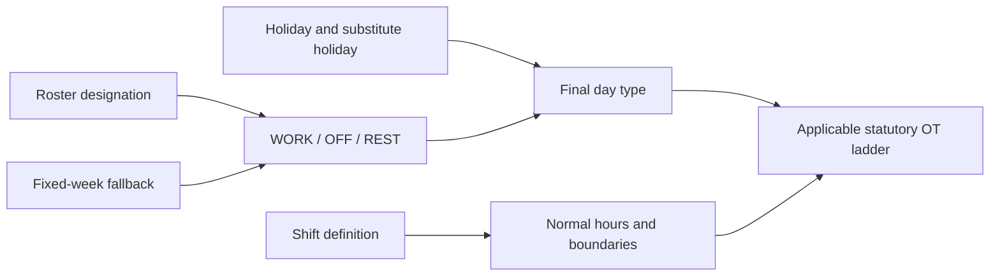
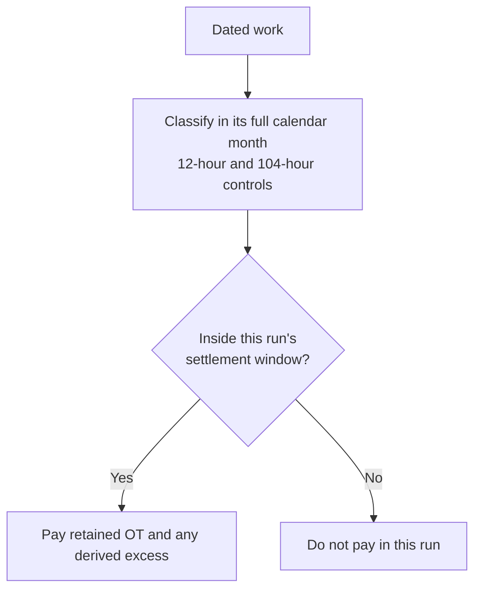

# Time, overtime and cutoffs

## From roster to day type

Day type is calculated before money:



For a rostered shift worker, the dated roster is authoritative. `WORK` is ordinary, `REST` is the
statutory rest day and `OFF` is an off day. When no roster exists, working days per week and the
configured rest weekday provide a fixed-week fallback.

`REST` does not mean that work is impossible. Malaysian law requires a weekly rest day; for shift
work, a continuous period of at least 30 hours can constitute that day. The employer prepares the
rest-day roster before the month. Work performed on the designated rest day remains rest-day work
and receives the rest-day ladder; it does not become ordinary OT merely because a replacement was
called in. `OFF` is an additional non-working day and is not interchangeable with the statutory
rest day. A genuine shift swap changes the dated roster before settlement rather than relabelling
the hours after they were worked.

An employee generally cannot be compelled to work on a rest day except for continuous/shift work or
the statutory exceptional circumstances. The engine still prices approved work that occurred; a
payment calculation is not evidence that scheduling the work was compliant.

A public holiday can replace an ordinary day. If a paid holiday falls on the statutory rest day,
the next working day is the substitute unless an explicit `company_holidays.substitutes_date`
already defines one. This changes schedule classification; it does not invent an OIL transaction.

## Authorisation gates

An overtime amount is produced only when all relevant gates pass:

1. the time entry is approved and `CLOSED`;
2. the shift permits overtime;
3. `overtime_authorized` is not explicitly false;
4. a separately punched OT interval, when supplied, is complete and forward-running; and
5. payable duration remains after flooring.

Approved legacy buckets supply the authorised duration, but labels such as `1.5`, `2.0` and `3.0`
do not override the legal day type. The schedule decides whether the same hours were ordinary,
rest-day or public-holiday work.

## Hours

For an ordinary scheduled day without a dedicated OT punch:

```text
raw OT = clock-out − scheduled shift end − configured OT break
```

Early clock-in does not earn time because clock-in is clamped to shift start. On a rest, off or
holiday day, clocked work is measured from the actual punches less the applicable unpaid break.

Every dated quantity is floored down to a half-hour:

```text
1.99 → 1.5 hours
2.00 → 2.0 hours
2.49 → 2.0 hours
2.50 → 2.5 hours
```

There is no round-up and no automatic one-hour minimum.

## Pricing

An example company configuration uses the annualised dated method:

```text
HRP             = round(monthly salary × 12 / (weekly hours × 52), 2)
dated unit rate = round(HRP × statutory multiple, 2)
dated amount    = round(dated units × dated unit rate, 2)
payroll amount  = sum(dated amounts in the payment window)
```

The engine also calculates the statutory Malaysian floor when required:

```text
statutory HRP = round((monthly salary / 26) / normal daily hours, 2)
effective HRP = max(configured-method HRP, statutory HRP)
```

Ordinary/off-day work uses the ordinary OT ladder. Rest-day and public-holiday work can contain a
day-wage award for work within normal hours and an hourly award beyond normal hours. This is why
simply multiplying all source “1.5” bucket hours can differ from the statutory result.

## Incentive OT (`OVERTIME_EXCESS`)

Incentive OT is calculated output. Source incentive-overtime columns are never an input.

Two independent limits classify already-earned statutory OT value:

### Daily total-work boundary

```text
daily excess hours = floor½(max(0, actual work hours − 12))
retained OT hours  = payable OT hours − daily excess hours
```

The legal ladder prices the whole day first. The value associated with excess hours is moved to the
matching `OVERTIME_EXCESS` component at the same statutory value; it is not discarded. A warning
still identifies work beyond 12 hours because reclassification does not make the schedule compliant.
The 12-hour boundary is the statutory daily maximum outside the Act's exceptional circumstances,
not a daily OT entitlement or a rule that permits twelve overtime hours.

### Calendar-month 104-hour boundary

The 104-hour counter:

- resets on the first day of the calendar month;
- counts ordinary-day and off-day OT;
- excludes rest-day and paid-public-holiday work; and
- advances chronologically by the full qualifying quantity, even when some hours also crossed the
  daily boundary.

Only the portion above 104 hours is moved to `OVERTIME_EXCESS`.

## Payment window versus compliance month

These are separate axes:



For January payroll with a 21st cutoff, the engine reads full December and January calendar months
to classify the dated hours, but pays only 21 December–20 January. Work on 21–31 January remains in
January's 104-hour counter and is paid by the following settlement window.

There is no blanket one-month incentive lag. Chronological classification determines whether a
specific dated hour crossed the threshold; the attendance window determines which run pays it.

## Coverage

For Malaysian OT/rest-day/holiday provisions, monthly salary and
`statutory_work_category` determine statutory coverage. A contractual entitlement can be more
favourable. The legacy `work_classification = NON_EA` label is not, by itself, proof that the
Employment Act does not apply.

The Act's general protections cover private-sector employees, but employees earning more than
RM4,000 a month who are not manual employees are excluded from the statutory claims for overtime,
rest-day work and paid-holiday work. Manual employees remain in the protected category regardless
of that threshold. The effective employment fact therefore stores manual/non-manual status instead
of inferring entitlement from job title text.
